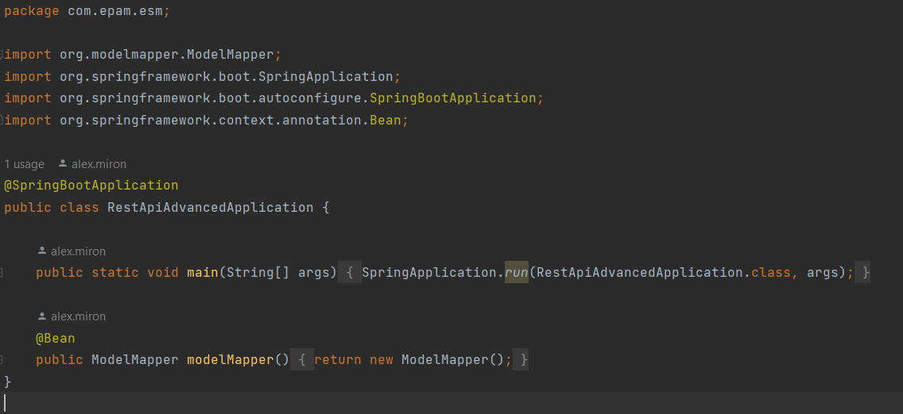
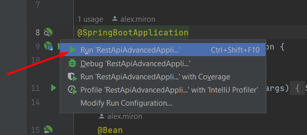

# REST-API-ADVANCED

## Description

It is a REST API's application written in java. That has some entities gift_certificate(with fields- id, name, description, price, duration, create date, last update date ), tags(with fields - id, name), user(with fields- id, name) and orders(with fields-id, price, purchase time, user's id, gift certificate's id). Also, there are some relationships between entities, for example, gift certificates and tags are connected as many to many, users and orders as one to many, etc. Some functions were realized like CRUD operations for gift certificates and users. If new tags are passed during creation/modification – they should be created in the DB. For update operation - update only fields, that pass in requests, others should not be updated.CRD operations for the tags and orders. Also, get certificates with tags by tag name, search by part of the description, and sort by date ASC. Also, were realized get users' orders, get information about them, and get the most widely used tag of a user with the highest cost of all orders.
## Technologies
1. Java Core (Collections, Generics, Java 17, java.time.*).
2. Spring boot.
3. To store data used relation database - PostgreSQL.
4. For access to data used JPA repository & Hibernate.
5. ORM.
6. Lombok, Model Mapper.
7. HATEOAS.
8. Build tool: Maven.
9. Documented code and commented code (using log4j).
10. JSON.
11. For testing used h2 database, JUnit5 and Mockito.

## Instruction for launch
1. Open IDE (recommend IntelliJ IDEA).
2. Press to Get from VCS.
3. Insert this URL to according field

```bash
https://github.com/alexMIRON1/REST-API-ADVANCED.git
```
4. Take a directory and press clone.
5. After all what was described above, you have to open RestApiAdvancedApplication.class



6. And launch it.



7. Finish.